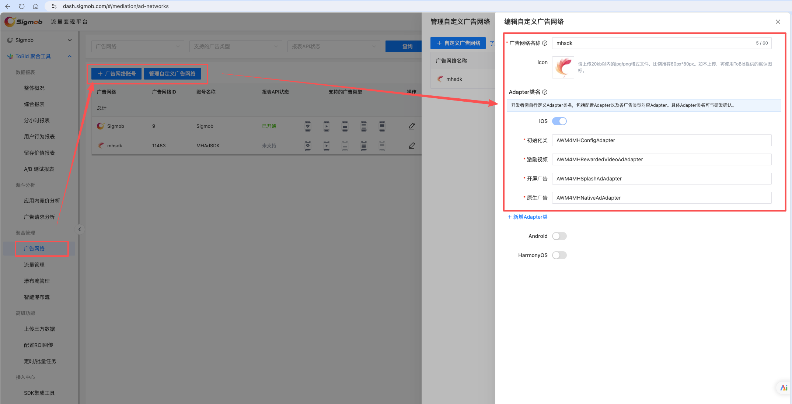
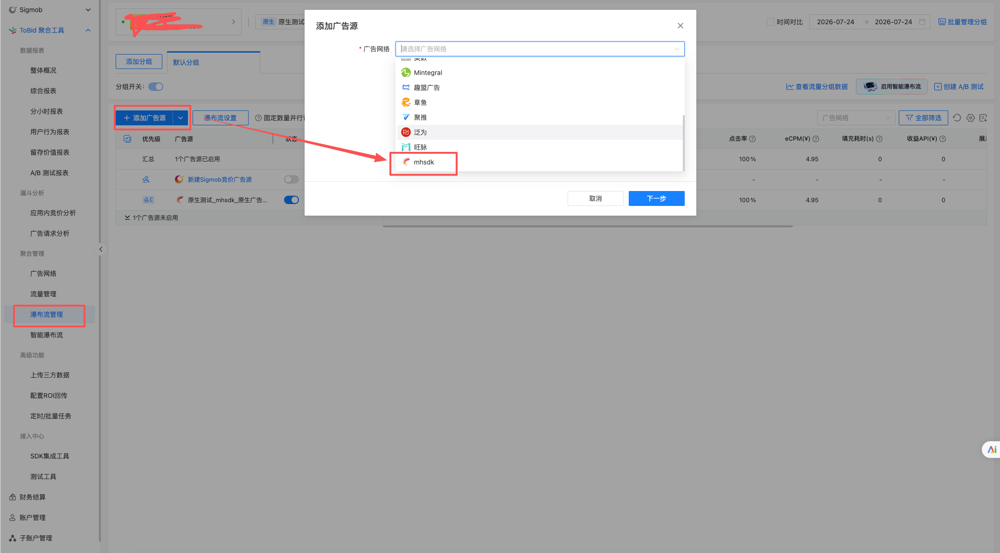
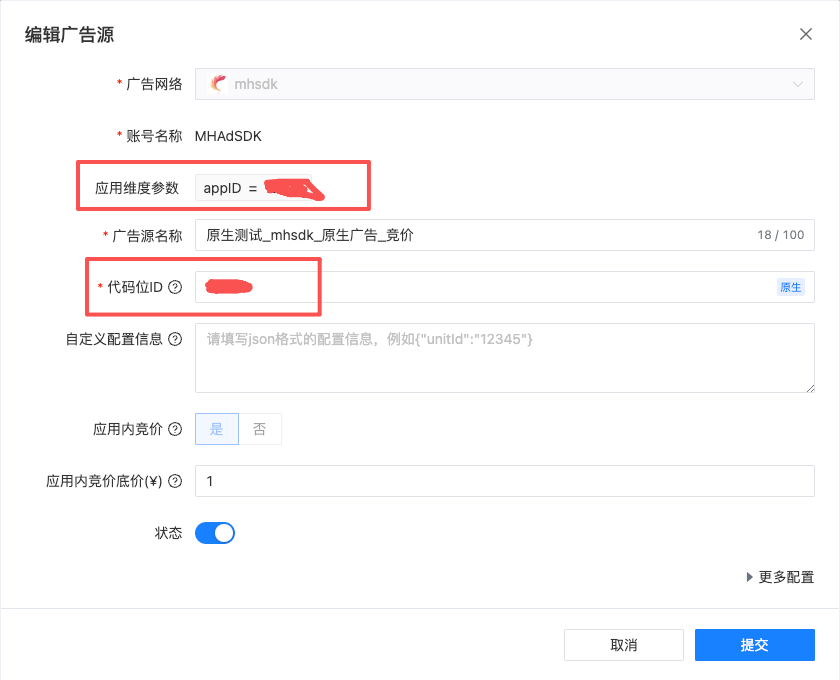

# MHAdSDK-ToBidAdapter

MHAdSDK 的 ToBid 聚合适配器，支持开屏、原生信息流、激励视频三种广告类型。

## 参考文档

- MHAdSDK 接入文档请参考枫岚SDK开发文档
- ToBid 配置请参考：<https://doc.sigmaboard.cn/tobid/21053/>

## ToBid 后台配置

> **注意：** 关联好 ToBid 三方广告位，必须对应枫岚提供的 appID 和 posID，否则无法请求广告。

### 1. 创建三方 SDK 与 Adapter 关联



### 2. 瀑布流管理



### 3. 广告位参数配置



## Podfile 配置

Adapter 同时依赖 MHAdSDK 和 ToBid SDK，Podfile 需要如下配置：

```ruby
source 'https://cdn.cocoapods.org/'

platform :ios, '12.0'

target 'MHAdSDKDemo' do
  use_frameworks! :linkage => :static

  # MH 广告 SDK
  pod 'MHAdSDK', '~> 1.4.5'
  # ToBid 广告聚合 SDK
  pod 'ToBid-iOS'
  # MHAdSDK-ToBid 适配器
  pod 'MHAdSDK-ToBidAdapter', '~> 1.0.1'
end
```

## 接入示例

---

### 开屏广告

> 参考 Demo：`MHSplashViewController`

#### 声明代理

```objc
#import <WindMillSDK/WindMillSDK.h>

@interface MHSplashViewController () <WindMillSplashAdDelegate>

@property (nonatomic, strong) WindMillSplashAd *splashAd;

@end
```

#### 创建广告对象并加载

```objc
// 构建 request
WindMillAdRequest *request = [WindMillAdRequest request];
request.placementId = self.adID;

// 创建 ToBid 开屏广告实例
self.splashAd = [[WindMillSplashAd alloc] initWithRequest:request extra:extra];
self.splashAd.rootViewController = self;
self.splashAd.delegate = self;

// 先加载，加载成功后在 onSplashAdDidLoad: 中展示
[self.splashAd loadAd];
```

#### 实现代理回调

```objc
#pragma mark - WindMillSplashAdDelegate

- (void)onSplashAdDidLoad:(WindMillSplashAd *)splashAd {
    NSLog(@"开屏广告加载成功，开始展示");
    UIWindow *window = self.view.window;
    if (!window) {
        window = [UIApplication sharedApplication].windows.firstObject;
    }
    [splashAd showAdInWindow:window withBottomView:self.bottomView];
}

- (void)onSplashAdLoadFail:(WindMillSplashAd *)splashAd error:(NSError *)error {
    NSLog(@"开屏广告加载失败: %@", error);
}

- (void)onSplashAdSuccessPresentScreen:(WindMillSplashAd *)splashAd {
    NSLog(@"开屏广告已展示");
    WindMillAdInfo *adInfo = splashAd.adInfo;
    uint32_t ecpm = adInfo.eCPM; // 单位：分
    NSLog(@"开屏广告 eCPM: %u", ecpm);
}

- (void)onSplashAdFailToPresent:(WindMillSplashAd *)splashAd withError:(NSError *)error {
    NSLog(@"开屏广告展示失败: %@", error);
}

- (void)onSplashAdClicked:(WindMillSplashAd *)splashAd {
    NSLog(@"开屏广告点击");
}

- (void)onSplashAdSkiped:(WindMillSplashAd *)splashAd {
    NSLog(@"开屏广告跳过");
}

- (void)onSplashAdWillClosed:(WindMillSplashAd *)splashAd {
    NSLog(@"开屏广告即将关闭");
}

- (void)onSplashAdClosed:(WindMillSplashAd *)splashAd {
    NSLog(@"开屏广告已关闭");
}
```

---

### 原生信息流广告

> 参考 Demo：`MHNativeViewController`

#### 声明代理

```objc
#import <WindMillSDK/WindMillSDK.h>
#import <MHAdSDK/MHNativeAd.h>
#import "AWM4MHNativeAdAdapter.h"

@interface MHNativeViewController () <WindMillNativeAdsManagerDelegate>

@property (nonatomic, strong) WindMillNativeAdsManager *nativeAdsManager;
@property (nonatomic, strong) MHNativeAd *nativeAd;
@property (nonatomic, strong) NSArray<WindMillNativeAd *> *windMillNativeAds;
@property (nonatomic, strong) NSMutableArray<MHNativeAdModel *> *adArray;

@end
```

#### 创建广告对象并加载

```objc
WindMillAdRequest *request = [[WindMillAdRequest alloc] init];
request.placementId = self.adID;
// 通过 options 传递自定义参数，Adapter 中通过 [self.bridge adRequest].options 读取
request.options = @{
    @"MHIsMuted": self.isMuted ? @"1" : @"0",
    @"MHAutoPlayMobileNetwork": self.isAutoPlayMobileNetwork ? @"1" : @"0"
};

self.nativeAdsManager = [[WindMillNativeAdsManager alloc] initWithRequest:request];
self.nativeAdsManager.delegate = self;
[self.nativeAdsManager loadAdDataWithCount:1];
```

#### 实现代理回调

```objc
#pragma mark - WindMillNativeAdsManagerDelegate

/// 广告加载成功
- (void)nativeAdsManagerSuccessToLoad:(WindMillNativeAdsManager *)nativeAdsManager {
    // 从 adapter 单例获取 MHNativeAd 和 models
    AWM4MHNativeAdAdapter *adapter = [AWM4MHNativeAdAdapter sharedInstance];
    self.nativeAd = adapter.lastLoadedNativeAd;
    self.nativeAd.rootController = self;
    NSArray<MHNativeAdModel *> *models = adapter.lastLoadedModels;

    // 清空 adapter 引用，避免生命周期问题
    adapter.lastLoadedNativeAd = nil;
    adapter.lastLoadedModels = nil;

    if (models.count == 0) {
        NSLog(@"原生广告无填充");
        return;
    }

    // 强引用 ToBid 广告对象，防止内部 WeakArray 丢失引用
    self.windMillNativeAds = [nativeAdsManager getAllNativeAds];

    [self.adArray removeAllObjects];
    for (MHNativeAdModel *model in models) {
        [self.adArray addObject:model];
    }

    [self.nativeTableView reloadData];
}

/// 广告加载失败
- (void)nativeAdsManager:(WindMillNativeAdsManager *)nativeAdsManager
        didFailWithError:(NSError *)error {
    NSLog(@"原生广告加载失败: %@", error.localizedDescription);
}
```

#### 在 TableView Cell 中渲染广告

```objc
// cellForRow 中设置广告模型
MHNativeListAdCell *cell = [tableView dequeueReusableCellWithIdentifier:@"MHNativeListAdCell"];
cell.nativeAd = self.nativeAd;
MHNativeAdModel *model = self.adArray[indexPath.row];

// 在 cell 内部渲染
self.nativeAdView.titleLabel.text = model.title;
self.nativeAdView.descriptionLabel.text = model.description;
self.nativeAdView.adView.nativeAdModel = model;

// 注册曝光和点击
[self.nativeAd showInViews:@[self.nativeAdView.adView]
    withClickableViewsArray:@[@[self.nativeAdView.adButton]]];
```

---

### 激励视频广告

> 参考 Demo：`MHRewardVideoViewController`

#### 声明代理

```objc
#import <WindMillSDK/WindMillSDK.h>

@interface MHRewardVideoViewController () <WindMillRewardVideoAdDelegate>

@property (nonatomic, strong) WindMillRewardVideoAd *rewardVideoAd;

@end
```

#### 创建广告对象并加载

```objc
WindMillAdRequest *request = [WindMillAdRequest request];
request.placementId = self.adID;
// 通过 options 传递自定义参数
request.options = @{@"MHIsMuted": self.isMuted ? @"1" : @"0"};

self.rewardVideoAd = [[WindMillRewardVideoAd alloc] initWithRequest:request];
self.rewardVideoAd.delegate = self;

// 先加载，加载成功后在 rewardVideoAdDidLoad: 中展示
[self.rewardVideoAd loadAdData];
```

#### 实现代理回调

```objc
#pragma mark - WindMillRewardVideoAdDelegate

/// 加载成功，开始展示
- (void)rewardVideoAdDidLoad:(WindMillRewardVideoAd *)rewardVideoAd {
    NSLog(@"激励视频加载成功，开始展示");
    [rewardVideoAd showAdFromRootViewController:self options:nil];
}

/// 加载失败
- (void)rewardVideoAdDidLoad:(WindMillRewardVideoAd *)rewardVideoAd
            didFailWithError:(NSError *)error {
    NSLog(@"激励视频加载失败: %@", error);
}

/// 已经展示
- (void)rewardVideoAdDidVisible:(WindMillRewardVideoAd *)rewardVideoAd {
    NSLog(@"激励视频已经展示");
    WindMillAdInfo *adInfo = rewardVideoAd.adInfo;
    uint32_t ecpm = adInfo.eCPM; // 单位：分
    NSLog(@"激励视频 eCPM: %u", ecpm);
}

/// 展示失败
- (void)rewardVideoAdDidShowFailed:(WindMillRewardVideoAd *)rewardVideoAd
                             error:(NSError *)error {
    NSLog(@"激励视频展示失败: %@", error);
}

/// 用户点击
- (void)rewardVideoAdDidClick:(WindMillRewardVideoAd *)rewardVideoAd {
    NSLog(@"激励视频已点击");
}

/// 返回激励结果（必须实现）
- (void)rewardVideoAd:(WindMillRewardVideoAd *)rewardVideoAd
               reward:(WindMillRewardInfo *)reward {
    NSLog(@"激励结果: %d", reward.isCompeltedView);
    // isCompeltedView == YES 表示用户完整观看，可以发放奖励
}

/// 播放结束
- (void)rewardVideoAdDidPlayFinish:(WindMillRewardVideoAd *)rewardVideoAd
                  didFailWithError:(NSError *)error {
    NSLog(@"激励视频播放结束");
}

/// 广告关闭
- (void)rewardVideoAdDidClose:(WindMillRewardVideoAd *)rewardVideoAd {
    NSLog(@"激励视频已关闭");
}
```

## 注意事项

- `request.placementId` 必须使用 ToBid 后台的广告位 ID（不是 MHAdSDK 的 posID）
- eCPM 单位为**分**（uint32_t），需要通过 `adInfo.eCPM` 获取
- 原生广告需要强引用 `WindMillNativeAd` 对象数组，防止 ToBid 内部 WeakArray 丢失引用
- 激励视频的 `rewardVideoAd:reward:` 回调是**必须实现**的代理方法
